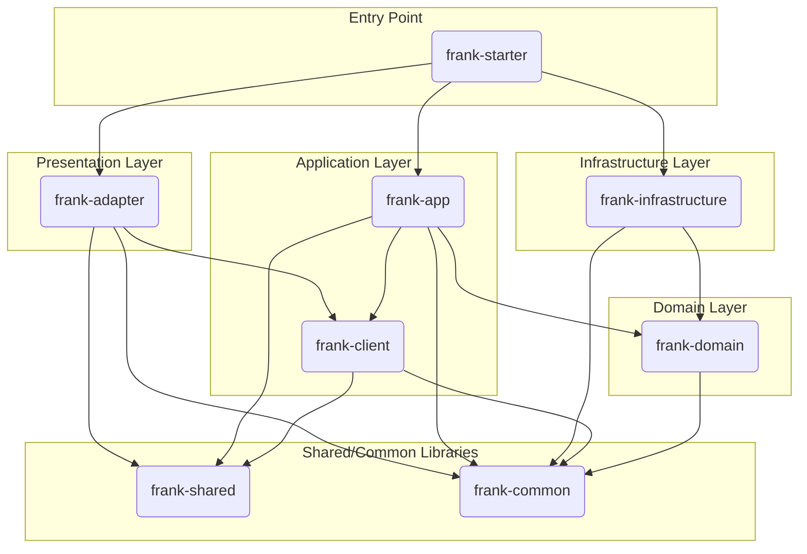

# 项目技术概览

本文档由 Gemini CLI 根据对当前代码库的分析自动生成，旨在为开发人员提供一个全面的技术概览。

## 严格遵循的指令
1.请你用简体中文与用户交流。
2.你必须在每次对话前**仔细**阅读你的内部规则，这很重要，否则整个工作流程都无法继续。
3.仔细理解用户的意图，当你认为用户的意图是一次大需求时，请合理规划最佳路径。必要时可以在创建一个TODO任务来跟踪这个需求的进展，你需要使用记忆工具来创建和管理这些任务。
4.请确保在每次对话开始前检查记忆中是否存在与当前会话相关的未完成任务。当存在未完成任务时，请在对话中持续跟踪。每当一个任务完成后，必须在回答结束前通过记忆工具来更新任务状态。


## 1. 核心功能 (Core Functionality)

本项目是一个基于 **DDD (领域驱动设计)** 思想构建的后端服务应用。从代码结构和命名（如 `UserManagementController`, `User` 实体, `IUserGateway`）来看，其核心业务是围绕**用户管理**展开的。

主要功能点包括：
*   提供用户信息的增删改查（CRUD）API 接口。
*   实现了基于 Token 的身份认证和权限控制（通过 `JWT` 依赖推断）。
*   具备清晰的业务领域划分，易于扩展新的业务模块。

## 2. 技术栈 (Tech Stack)

项目采用了一套现代化且成熟的 Java 技术栈。

*   **核心框架:**
    *   **Spring Boot 3.x:** 作为应用的基础框架，用于快速构建和配置独立的、生产级的 Spring 应用。
*   **编程语言:**
    *   **Java 17:** 利用 Java 的新特性，提升代码的简洁性和性能。
*   **数据持久化:**
    *   **MyBatis-Plus:** 在 MyBatis 基础上进行了增强，简化了数据访问层的开发，提供了强大的 CRUD 功能和查询构造器。
    *   **Druid:** 高性能的数据库连接池。
    *   **数据库驱动:** 同时包含了 PostgreSQL 和 MySQL 的 JDBC 驱动，表明项目可能需要支持多种数据库环境。
*   **身份认证与安全:**
    *   **Sa-Token:** 一个功能强大的 Java 权限认证框架，用于处理登录、权限校验、Session管理等。
    *   **JWT (jjwt):** 用于生成和解析 JSON Web Tokens，是无状态认证的核心。
*   **API 与文档:**
    *   **Spring Web (MVC):** 用于构建 RESTful API。
    *   **Knife4j:** 一个基于 OpenAPI 3 的增强型 API 文档工具，提供了美观且功能丰富的界面。
*   **工具库:**
    *   **Lombok:** 通过注解自动生成 Getter, Setter, Constructor 等样板代码，简化实体类和DTO的编写。
    *   **MapStruct:** 高性能的 Java Bean 映射工具，用于在不同层（如 DTO 和 Entity）之间进行对象转换。
    *   **Hutool:** 一个功能丰富的 Java 工具类库，简化了文件、日期、字符串等常用操作。
    *   **EasyExcel:** 用于简化 Java 对 Excel 的读写操作。
*   **构建与依赖管理:**
    *   **Maven:** 用于项目构建和依赖管理。

## 3. 架构风格 (Architectural Style)

本项目采用了典型的 **分层架构** 和 **整洁架构 (Clean Architecture)** 的设计思想，通过多模块（Multi-Module）的方式实现。这种架构将系统划分为一系列独立的、功能明确的模块，体现了“高内聚、低耦合”的设计原则。

*   **架构图 (逻辑):**

    ```
    +-------------------------------------------------------------------+
    | frank-adapter (适配器层 - Controllers)                              |
    +-------------------------------------------------------------------+
    | frank-app (应用服务层 - Service Impl)                               |
    +-------------------------------------------------------------------+
    | frank-client (客户端层 - Service Interface)                         |
    +-------------------------------------------------------------------+
    | frank-domain (领域层 - Entities, Gateways)                          |
    +-------------------------------------------------------------------+
    | frank-infrastructure (基础设施层 - DB, Caches, Gateways Impl)     |
    +-------------------------------------------------------------------+
    | frank-shared (共享数据结构 - DTOs) / frank-common (通用工具)        |
    +-------------------------------------------------------------------+
    ```

*   **优势分析:**
    *   **关注点分离 (Separation of Concerns):** 每个模块都有明确的职责。`domain` 层只关心业务规则，`infrastructure` 层只关心技术实现（如数据库），`adapter` 层只关心与外部的交互。
    *   **可测试性:** 核心的业务逻辑（`domain` 和 `app`）不依赖于任何具体的技术实现，可以非常方便地进行单元测试。
    *   **可维护性与灵活性:** 当需要更换数据库（例如从 MySQL 切换到 PostgreSQL）或更换 Web 框架时，理论上只需要修改 `infrastructure` 层和 `adapter` 层，而核心的 `domain` 层保持不变。

## 4. 项目结构 (Project Structure)

项目的模块划分严格遵循了上述的架构风格，每个模块的职责如下：

*   `frank-starter`: **启动模块**
    *   包含 `main` 方法，是整个应用程序的入口。
    *   负责组装所有其他模块，并进行 Spring Boot 的自动配置和扫描。
    *   存放应用的全局配置文件（`application.yml`）。

*   `frank-adapter`: **适配器模块**
    *   负责处理外部输入，主要是 RESTful API 的实现。
    *   包含所有的 `Controller` 类，将 HTTP 请求转换为对 `app` 层的调用。

*   `frank-app`: **应用服务模块**
    *   实现了 `client` 层定义的业务接口。
    *   负责编排和协调 `domain` 层的领域对象和领域服务，以完成一个完整的业务用例。

*   `frank-client`: **客户端模块**
    *   定义了应用服务层对外暴露的接口 (`IUserManagementService`)。
    *   这一层是 `adapter` 和 `app` 之间的桥梁，定义了清晰的服务契约。

*   `frank-domain`: **领域模块**
    *   项目的核心，包含了业务领域的实体 (`User`)、值对象和领域事件。
    *   定义了仓储（Repository）或网关（Gateway）的接口 (`IUserGateway`)，用于声明数据持久化的契约，但不包含具体实现。

*   `frank-infrastructure`: **基础设施模块**
    *   提供了 `domain` 层定义的接口的具体实现。
    *   包含了 `Mapper` 接口（MyBatis）、`Gateway` 实现类，以及与数据库、缓存、消息队列等外部系统交互的代码。

*   `frank-shared`: **共享数据模块**
    *   定义数据传输对象 (DTOs)，如 `UserResp`，用于在各层之间，特别是 `adapter` 层与外部客户端之间传输数据。

*   `frank-common`: **通用工具模块**
    *   存放整个项目可复用的工具类、常量、枚举和自定义异常等。

## 5. 启动与配置 (Bootstrap & Configuration)

*   **启动入口:**
    *   应用程序的启动类是 `org.frank.starter.FrankStarterApplication`。
    *   `@SpringBootApplication(scanBasePackages = "org.frank")` 注解表明它会扫描 `org.frank` 包下的所有组件。
    *   `@MapperScan("org.frank.infrastructure.mapper")` 注解指定了 MyBatis `Mapper` 接口的位置。

*   **核心配置:**
    *   主要的配置文件位于 `frank-starter/src/main/resources/application.yml`。
    *   **环境隔离:** 通过 `spring.profiles.active: dev` 激活 `application-dev.yml`，实现了开发、生产等不同环境的配置分离。
    *   **关键配置项:**
        *   `server.port`: 应用监听的端口。
        *   `server.servlet.context-path`: 应用的访问根路径。
        *   `mybatis-plus.*`: MyBatis-Plus 的相关配置，如 Mapper XML 文件的位置、主键策略等。
        *   `knife4j.*`: API 文档的相关配置。
        *   数据库连接信息（如 `spring.datasource.*`）位于特定环境的配置文件中（如 `application-dev.yml`）。

## 6. 模块文件地址 (Module File Address)

以下是每个模块内部核心包的规范和作用说明。

### `frank-starter`
*   **`src/main/java/org/frank/starter`**:
    *   **规范**: 存放 `main` 方法所在的启动类 `FrankStarterApplication`。
    *   **作用**: 整个应用的入口，负责启动 Spring Boot 应用和自动配置。
*   **`src/main/java/org/frank/starter/config`**:
    *   **规范**: 存放项目的配置类，例如 `MyBatisPlusConfig`、`SaTokenConfig` 等。
    *   **作用**: 用于以 Java-based 的方式配置第三方库或自定义组件。
*   **`src/main/resources`**:
    *   **规范**: 存放应用的静态资源和配置文件。
    *   **作用**: 包含 `application.yml` (主配置), `application-dev.yml` (开发环境配置), `application-prod.yml` (生产环境配置) 以及日志配置文件 `log4j2.xml`。

### `frank-adapter`
*   **`src/main/java/org/frank/adapter/controller`**:
    *   **规范**: 存放所有对外提供 RESTful API 的 Controller 类。
    *   **作用**: 作为HTTP请求的入口，接收参数，调用 `frank-app` 层的服务，并返回 `AjaxResult` 包装后的结果。
*   **`src/main/java/org/frank/adapter/controller/exception`**:
    *   **规范**: 存放全局异常处理器。
    *   **作用**: 使用 `@RestControllerAdvice` 注解，捕获 Controller 层抛出的特定异常（如 `NotLoginException`），并返回统一的错误响应。

### `frank-app`
*   **`src/main/java/org/frank/app/service`**:
    *   **规范**: 存放业务逻辑的具体实现类，命名通常以 `ServiceImpl` 结尾。
    *   **作用**: 实现 `frank-client` 中定义的业务接口，编排领域对象和网关，完成完整的业务流程。
*   **`src/main/java/org/frank/app/util`**:
    *   **规范**: 存放应用层特有的工具类。
    *   **作用**: 例如 `TokenUtils`，用于处理与Token相关的特定逻辑，仅在应用层内部使用。

### `frank-client`
*   **`src/main/java/org/frank/client/service`**:
    *   **规范**: 存放业务逻辑的接口，命名通常以 `Service` 结尾。
    *   **作用**: 定义了应用层需要向外（主要是 `adapter` 层）暴露的服务契约，是各层之间解耦的关键。

### `frank-domain`
*   **`src/main/java/org/frank/domian/entity`**:
    *   **规范**: 存放领域实体（Entity）。
    *   **作用**: 包含丰富的业务逻辑和状态，是领域模型的核心。例如 `User` 实体。
*   **`src/main/java/org/frank/domian/gateway`**:
    *   **规范**: 存放数据持久化的接口，即网关（Gateway）接口。
    *   **作用**: 定义了领域层希望基础设施层如何持久化其状态的契约，例如 `IUserGateway` 定义了对 `User` 实体的增删改查操作。

### `frank-infrastructure`
*   **`src/main/java/org/frank/infrastructure/gateway`**:
    *   **规范**: 存放 Gateway 接口的具体实现类，命名以 `Impl` 结尾。
    *   **作用**: 实现 `frank-domain` 中定义的持久化接口，将领域对象与数据库记录进行转换，并调用 Mapper 完成实际的数据库操作。
*   **`src/main/java/org/frank/infrastructure/mapper`**:
    *   **规范**: 存放 MyBatis-Plus 的 Mapper 接口。
    *   **作用**: 直接与数据库表进行映射，提供底层的、面向数据记录的 CRUD 操作。

### `frank-shared`
*   **`src/main/java/org/frank/shared/user/req`**:
    *   **规范**: 存放用户模块相关的请求数据传输对象 (Request DTO)。
    *   **作用**: 用于封装从客户端（如前端）传递过来的请求数据。
*   **`src/main/java/org/frank/shared/user/resp`**:
    *   **规范**: 存放用户模块相关的响应数据传输对象 (Response DTO)。
    *   **作用**: 用于封装需要返回给客户端的数据，避免直接暴露领域实体。

### `frank-common`
*   **`src/main/java/org/frank/common/config`**:
    *   **规范**: 存放应用全局的配置类。
    *   **作用**: 例如 `MybatisPlusPageConfig` 用于配置MyBatis-Plus的分页插件。
*   **`src/main/java/org/frank/common/constant`**:
    *   **规范**: 存放整个应用范围内的静态常量。
    *   **作用**: 定义了如缓存键 (`CacheConstants`)、通用业务常量 (`Constants`)、HTTP状态码 (`HttpStatus`) 和定时任务常量 (`ScheduleConstants`)，便于统一管理和复用。
*   **`src/main/java/org/frank/common/core/domain`**:
    *   **规范**: 存放核心的、通用的数据模型。
    *   **作用**: `AjaxResult` 是标准的API响应结构；`BaseEntity` 是所有数据库实体类的基类，包含通用字段（如创建/更新时间）；`LoginUser` 封装了登录用户的核心信息。
*   **`src/main/java/org/frank/common/core/redis`**:
    *   **规范**: 存放Redis相关的工具类。
    *   **作用**: `RedisCache` 封装了 `RedisTemplate`，提供了更便捷的API来操作缓存，简化了对象的存取。
*   **`src/main/java/org/frank/common/enums`**:
    *   **规范**: 存放全局通用的枚举类。
    *   **作用**: 例如 `ResultCodeEnum` 定义了统一的API返回码和消息，使错误处理更规范。
*   **`src/main/java/org/frank/common/handler`**:
    *   **规范**: 存放一些框架级别的处理器。
    *   **作用**: `MyMetaObjectHandler` 实现了MyBatis-Plus的字段自动填充逻辑，在插入或更新时自动设置 `createBy`, `createTime` 等字段。
*   **`src/main/java/org/frank/common/util`**:
    *   **规范**: 存放全局通用的工具类。
    *   **作用**: `ServletUtils` 简化了对HTTP请求和响应的操作；`TokenService` 负责JWT的生成、解析和校验，是身份认证的核心。

## 7. 模块依赖关系图 (Module Dependency Diagram)

此图表展示了项目各个模块之间的依赖关系。箭头从依赖方指向被依赖方 (A --> B, 表示 A 依赖 B)，清晰地揭示了项目的分层结构和依赖规则。


